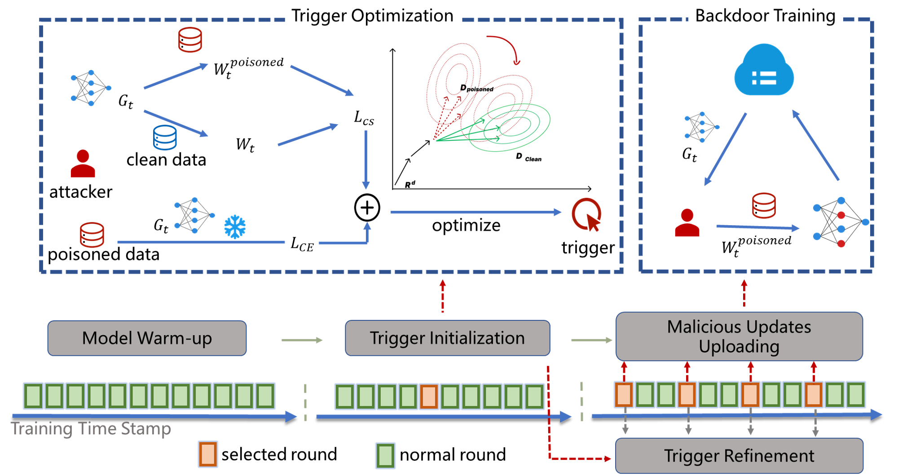

# Revisiting Defense Mechanisms in Federated Learning: Effective and Efficient Backdoor Attack via Trigger Pre-optimization

Xi Chen, Rui Zeng, [Yichi Zhang](https://yichics.github.io/), Chunyi Zhou, Yuwen Pu, Qingming Li, Zhe Liu, Lu Zhou and Shouling Ji

Code repository for the paper: [Revisiting Defense Mechanisms in Federated Learning: Effective and Efficient Backdoor Attack via Trigger Pre-optimization](https://yichics.github.io/files/Pub/PREFed.pdf). 

Under Construction

- [ ] add complete README.md